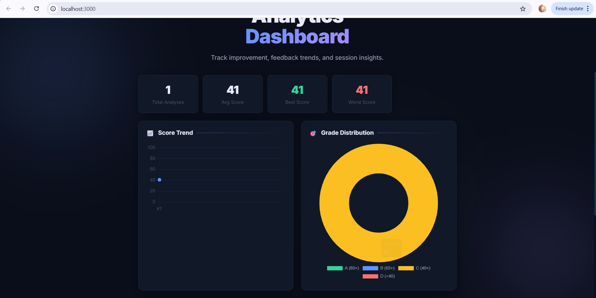

# AI Powered Prompt Engineering Technique and Optimization

## Project Overview
This project focuses on AI-powered prompt engineering techniques and optimization methods using Python, Data Analytics, Machine Learning, Streamlit, and MongoDB.

## Technologies Used
- Python
- SQL
- React.js
- MongoDB
- Machine Learning
- Data Analytics

## Features
- AI Prompt Optimization
- Data Visualization
- Interactive Dashboard
- Analytics Insights
- Machine Learning Integration

## Project Screenshots

Updated README with project details
